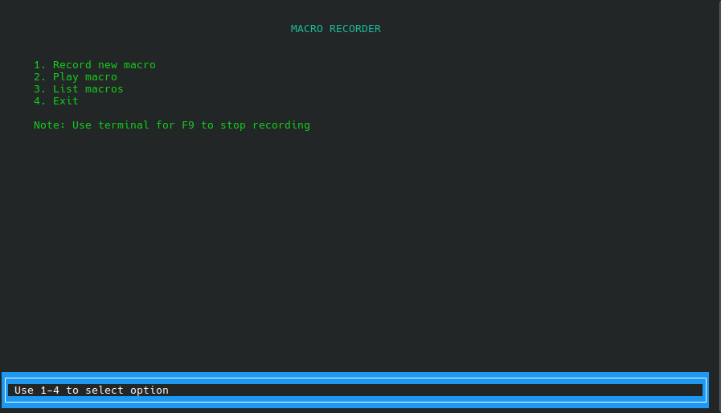
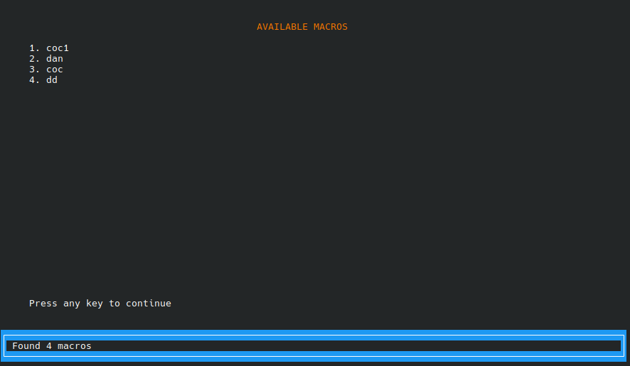

Idea Origins

The idea for this project came from the need for a true low-level macro system on Linux. Most existing solutions only work for simple desktop automation or 2D games, but they fail in fast-paced 3D environments. By directly using data from /dev/input/eventX, this macro recorder can capture and replay every mouse and keyboard action with high accuracy.

It works surprisingly well in games like Counter-Strike, ARK, Dota, and others (not perfect, but still very usable), and it’s flawless for 2D games and desktop automation. Personally, I first built it for ARK farming and later used it for coin farming in Clash of Clans

https://youtu.be/6riUZB1UrMA